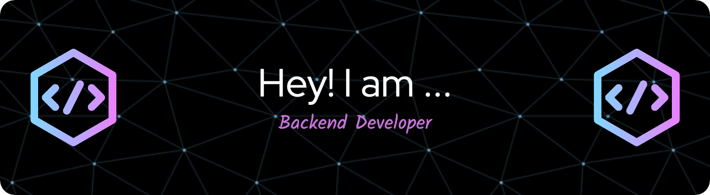

 

  <ul align="center" style="list-style: none">
    

      <h1>
        👋 Hi my name is 
      </h1>
    

  </ul>

**<h3 align="left">Connect with me:</h3>** 

 

 **<h3 align="left">🚀 Passionate backend web developer, creating robust and scalable web applications. Skilled in both front-end and back-end technologies, with a keen eye for user experience and performance optimization.</h3>**

**<h3 align="left">Rapid Fire</h3>**

- 💼 I'm currently working on: **💻 Developing a healh-care product**
- 🌱 I'm currently learning: **📚 Golang**, **🐍 Python**
- 💬 Ask me about: **💡 Php, MySQL, and REST APIs**
- ⚡ Fun fact: **🚆 I once debugged a issue while in a train carriage via mobie phone**

 **<h3 align="left">Skills</h3>**

          

 **<h3 align="left">GitHub Stats</h3>**

  
    

  

  

